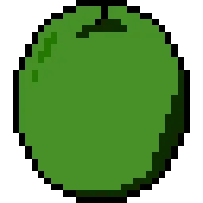

# Clicker Empire - Proyecto Final DAW

## 1. Portada
- **Título del proyecto:** Clicker Empire
- **Ciclo Formativo:** Desarrollo de Aplicaciones Web
- **Centro educativo:** I.E.S Suárez de Figueroa
- **Autor:** José Antonio Oliva Cortés
- **Tutor:** Israel Caldito Carrasco
- **Fecha de presentación:** 06/2025
- **Repositorio:** [GitHub - Clicker Empire](https://github.com/jaolivacortes/Portfolio/Proyecto_final)
- **Logotipo del proyecto:**
  

    
  

## 2. Índice
1. Portada
2. Índice
3. Introducción
4. Objetivos del proyecto
5. Justificación del proyecto
6. Recursos utilizados
7. Tecnologías de desarrollo
8. Diseño del proyecto
9. Lógica/codificación del proyecto
10. Despliegue Web del proyecto
11. Manual de usuario
12. Conclusiones y aspectos a mejorar
13. Bibliografía

## 3. Introducción
Clicker Empire es un juego de estrategia incremental que ofrece una experiencia de juego completa y moderna. El proyecto nace de la combinación de elementos clásicos de los juegos incrementales con características innovadoras que lo hacen único en su género.

### Características principales:
- **Progreso persistente:** Sistema de guardado automático en base de datos que permite a los jugadores mantener su progreso entre sesiones.
- **Sistema de ranking competitivo:** Clasificación global que fomenta la competencia entre jugadores y añade un elemento social al juego.
- **Foro de comunidad:** Espacio donde los jugadores pueden compartir estrategias, reportar bugs y socializar.
- **Perfil personalizable:** Sistema que permite a los usuarios personalizar su experiencia de juego y mostrar sus logros.
- **Sistema de logros:** Mecánica que recompensa a los jugadores por completar diferentes objetivos y desafíos.

### Tecnologías implementadas:
- Frontend desarrollado con Astro para una experiencia de usuario óptima
- Backend robusto con Laravel que garantiza la seguridad y escalabilidad
- Base de datos MySQL para el almacenamiento persistente
- Sistema de autenticación seguro
- API RESTful para la comunicación entre frontend y backend

## 4. Objetivos del proyecto

### Objetivos principales:
1. **Demostración de competencias técnicas:**
   - Aplicar los conocimientos adquiridos durante el ciclo formativo
   - Implementar las mejores prácticas de desarrollo web
   - Demostrar capacidad para integrar diferentes tecnologías

2. **Desarrollo de habilidades profesionales:**
   - Gestión de un proyecto completo desde el diseño hasta el despliegue
   - Resolución de problemas técnicos complejos
   - Implementación de soluciones escalables y mantenibles

3. **Creación de una aplicación funcional:**
   - Desarrollar un juego completo y jugable
   - Implementar todas las características planificadas
   - Asegurar un rendimiento óptimo y una experiencia de usuario fluida

4. **Aspectos técnicos específicos:**
   - Implementar un sistema de autenticación seguro
   - Desarrollar una API RESTful eficiente
   - Crear una base de datos optimizada
   - Gestionar el estado del juego de forma persistente
   - Implementar un sistema de ranking competitivo
   - Desarrollar un foro funcional y moderado

5. **Aspectos de despliegue:**
   - Configurar un entorno de producción estable
   - Implementar medidas de seguridad adecuadas
   - Asegurar la escalabilidad de la aplicación
   - Gestionar la base de datos en producción

## 5. Justificación del proyecto

### 5.1 Análisis de mercado
El proyecto surge de la observación del creciente interés en los juegos incrementales y la oportunidad de crear una versión que combine elementos de estrategia con características sociales. En el mercado actual existen juegos similares como Cookie Clicker o Idle Slayer, pero Clicker Empire se diferencia por su enfoque en la interacción social y la competitividad.

Además, el proyecto está diseñado con la posibilidad de implementar publicidad en el futuro, ya que la interfaz de usuario incluye espacios estratégicamente ubicados para la inserción de anuncios. Esta característica permite considerar el proyecto no solo como una demostración técnica, sino también como una aplicación con potencial económico, sin necesidad de recurrir a microtransacciones que podrían afectar negativamente la experiencia del usuario.

### 5.2 Vinculación con contenidos del Ciclo Formativo
El proyecto integra múltiples tecnologías y conceptos aprendidos durante el ciclo:

- **Backend (PHP/Laravel):**
  - Gestión de lógica de negocio
  - Control de sesiones
  - API RESTful
  - Middleware y autenticación

- **Base de datos (MySQL):**
  - Diseño y gestión de base de datos
  - Optimización de consultas
  - Relaciones y normalización

- **Frontend (Astro):**
  - Metodología BEM
  - Componentes reutilizables
  - Optimización de rendimiento

- **JavaScript:**
  - Interactividad del juego
  - Gestión de eventos y jQuery
  - Comunicación con API

- **DevOps:**
  - Configuración de Docker
  - Despliegue en producción
  - Gestión de versiones con Git

## 6. Recursos utilizados

### 6.1 Entornos de desarrollo
- **Visual Studio Code:** Desarrollo frontend con Astro y jQuery
- **IntelliJ IDEA:** Desarrollo backend con Laravel
- **MySQL Workbench:** Gestión y diseño de base de datos
- **GitHub:** Control de versiones y alojamiento del código
- **Render:** Plataforma de despliegue
- **Clever Cloud:** Hosting de base de datos y PHPMyAdmin
- **Piksel:** Diseño de imágenes
- **Pixabay:** Recursos de audio

### 6.2 Lenguajes de programación
- **PHP:** Backend y lógica de servidor
- **JavaScript:** Interactividad y lógica del juego
- **HTML/CSS/SCSS:** Estructura y estilos
- **SQL:** Consultas a base de datos

### 6.3 Utilidades y recursos
- **Frameworks:**
  - Laravel (Backend)
  - Astro (Frontend)
  - Bootstrap (Componentes UI)
  - jQuery (Manipulación DOM)

- **Herramientas de diseño:**
  - Piksel (Diseño de imágenes)
  - Pixabay (Efectos de sonido)

## 7. Tecnologías de desarrollo

### 7.1 Frontend
- **Astro:** Framework moderno para desarrollo web
- **Bootstrap:** Framework CSS para diseño responsive
- **jQuery:** Biblioteca JavaScript para manipulación DOM

### 7.2 Backend
- **Laravel:** Framework PHP para desarrollo web
- **Node.js:** Entorno de ejecución para desarrollo

### 7.3 Base de datos
- **MySQL:** Sistema de gestión de base de datos relacional

### 7.4 DevOps
- **Docker:** Contenedores
- **Git:** Control de versiones
- **Render:** Plataforma de despliegue
- **Clever Cloud:** Hosting de base de datos

## 8. Diseño del proyecto

### 8.1 Diseño de la base de datos
- [Diagrama E/R](https://github.com/jaolivacortes/Portfolio/Proyecto_final/blob/main/BD/ClickerEmpire%20-%20EER%20Diagram.pdf)
- [Modelo Relacional](https://github.com/jaolivacortes/Portfolio/Proyecto_final/blob/main/BD/ClickerEmpire%20-%20Modelo%20e_r.drawio.pdf)
- Script de carga inicial
  - [Creación BD](https://github.com/jaolivacortes/Portfolio/Proyecto_final/blob/main/BD/ClickerEmpireDB.sql)
  - [Insertar scripts en BD](https://github.com/jaolivacortes/Portfolio/Proyecto_final/blob/main/BD/ClickerEmpireDBInserts.sql)

### 8.2 Diseño de la interfaz de usuario
El diseño se basó en la experiencia de usuario de aplicaciones similares, optimizando la navegación y la experiencia de juego.

### 8.3 Roles de la aplicación
1. **Player:**
   - Acceso al juego
   - Participación en el foro
   - Gestión de perfil
   - Visualización de ranking

2. **Admin:**
   - Todas las funcionalidades de Player
   - Moderación del foro
   - Gestión de usuarios

### 8.4 Usuarios de prueba
- **Player:**
  - Email: player@gmail.com
  - Contraseña: 1234

- **Admin:**
  - Email: admin@gmail.com
  - Contraseña: 1234

## 9. Lógica/codificación del proyecto

### 9.1 Principales procesos
1. **Autenticación:**
   - Login
   - Registro
   - Gestión de sesiones

2. **Juego:**
   - Sistema de progreso
   - Economía del juego
   - Logros

3. **Social:**
   - Ranking
   - Foro
   - Perfiles

### 9.2 Aspectos relevantes de la implementación
- Validación de datos en frontend y backend
- Control de acceso mediante middleware
- Estructura de carpetas modular
- Comunicación API RESTful

## 10. Despliegue Web del proyecto

### 10.1 Requisitos hardware
- **Render.com (Plan gratuito):**
  - 0.1 vCPU
  - 512 MB RAM
  - Adecuado para desarrollo y pruebas

### 10.2 Servidores
- **Render.com:** Hosting de la aplicación
- **Clever Cloud:** Base de datos
- **GitHub:** Directorio de la aplicación

### 10.3 Seguridad
- HTTPS con encriptación
- SHA256 y Base64 para datos sensibles
- Tokens de autenticación Laravel
- Protección contra CSRF

### 10.4 Script de despliegue
- **render.yaml:** Configuración de despliegue
- **docker/apache/000-default.conf:** Configuración Apache
  - Document root
  - Reglas del servidor
  - Redirecciones

## 11. Manual de usuario
Para consultar el manual de usuario completo, visita el [README.md](https://github.com/jaolivacortes/Portfolio/Proyecto_final/blob/main/README.md) del proyecto, donde encontrarás:
- Instrucciones detalladas de instalación
- Configuración del entorno
- Guía de despliegue
- Solución de problemas comunes
- Información sobre usuarios de prueba y contribuciones

### Enlaces relevantes
- [Juego en producción](https://clickerempire.onrender.com/)
- [Repositorio GitHub](https://github.com/jaolivacortes/Portfolio/Proyecto_final)

## 12. Conclusiones y aspectos a mejorar

### 12.1 Retos superados

#### Elección de tecnologías
El primer reto significativo fue la decisión sobre el formato del proyecto. La elección de utilizar dos frameworks diferentes, Laravel y Astro, se basó en la búsqueda de una experiencia más cercana al desarrollo profesional real. Astro ofreció mayor seguridad y comodidad en comparación con la alternativa de usar Laravel con Blade, lo que resultó ser una decisión acertada para el desarrollo.

#### Integración de frameworks
El mayor desafío técnico fue la integración de Laravel y Astro, principalmente debido a problemas con CORS. La solución requirió una investigación profunda que llevó a la modificación de archivos de configuración críticos como `cors.php` y `session.php`. Estos cambios fueron necesarios para manejar correctamente la comunicación entre los dos entornos diferentes, especialmente considerando que operaban en IPs distintas.

#### Comunicación API y middleware
La implementación de la comunicación entre frontend y backend presentó varios desafíos:
- La gestión de llamadas fetch y respuestas JSON requirió un aprendizaje significativo, aunque una vez comprendido el flujo, la implementación fue más sencilla.
- Los middleware en los enrutados de `api.php` presentaron limitaciones, especialmente en el manejo de redirecciones. Aunque este aspecto podría mejorarse, la decisión de mantener la implementación actual se basó en la evaluación de la funcionalidad real de la aplicación y la gestión del flujo de información en los controladores.

#### Despliegue en producción
El despliegue en la nube presentó un desafío particular. La necesidad de una solución gratuita y funcional llevó a la decisión de unificar los proyectos, lo que implicó:
- Realizar un build del frontend
- Integrarlo en la carpeta public del backend de Laravel
- Crear un sistema de configuración dinámica mediante `config.js`

Esta solución no solo resolvió el problema de despliegue, sino que también llevó a mejoras inesperadas en la arquitectura del proyecto, como la implementación de rutas dinámicas y la corrección de problemas de navegación.

### 12.2 Aspectos a mejorar

#### Funcionalidades pendientes
1. **Foro:**
   - Implementación de sistema de respuestas a comentarios
   - Mejora de la moderación de contenido

2. **Seguridad:**
   - Implementación de recuperación de contraseña
   - Sistema de verificación de correo electrónico
   - Migración de lógica del juego al backend

3. **Juego:**
   - Refinamiento del sistema de progreso
   - Optimización de la lógica del juego

#### Consideraciones técnicas
La decisión de mantener la lógica del juego en el frontend (`miscript.js`) en lugar de migrarla al `GameController` se basó en un análisis de rendimiento y casos de uso similares. Juegos como Cookie Clicker utilizan un enfoque similar, ya que la migración completa de la lógica al backend podría impactar negativamente en el rendimiento. Sin embargo, esta es un área que podría reevaluarse en futuras versiones.

### 12.3 Aprendizajes y crecimiento
Este proyecto ha sido una experiencia de aprendizaje significativa que ha permitido:
- Desarrollar habilidades en la integración de diferentes tecnologías
- Comprender mejor los desafíos del desarrollo full-stack
- Aprender sobre despliegue y configuración en producción
- Mejorar en la resolución de problemas técnicos complejos

La experiencia adquirida en la resolución de problemas de CORS, la implementación de APIs, y la gestión del despliegue ha proporcionado conocimientos valiosos que serán útiles en futuros proyectos profesionales.

## 13. Bibliografía

1. Ruiz Rico, F. (s.f.). Cookie Clicker HTML, CSS y JavaScript - Parte 1. [Blog post]. Recuperado de https://fernandoruizrico.com/cookie-clicker-html-css-javascript-parte-1/

2. Programando en JAVA. (2023). Tutorial de desarrollo de juegos incrementales. [Video]. YouTube. https://www.youtube.com/watch?v=2rkoryDkf6o